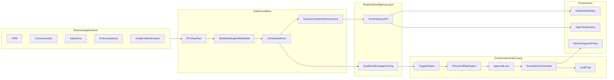

# caeesar Product Vision and Landing Narrative

## 1) Final homepage / landing copy structure

### Hero

**Headline**  
Unify enterprise data. Govern every AI action.

**Subheadline**  
caeesar is an agentic data platform that centralizes crucial business data, applies governance and trust controls, and enables both user-driven and data-driven automation.

**Primary CTA**  
Book a demo

**Secondary CTA**  
Open playground

### Problem section

Enterprise data and AI are fragmented:

- Crucial operational data lives across CRM, communication, sales, finance, and analytics systems.
- Each system now ships its own AI interface, creating isolated AI experiences.
- Teams cannot reliably apply one governance model across all AI interactions.

### Reframe section

The problem is not just better chat over one tool.  
The problem is a missing intelligence and orchestration layer across all business systems.

### Solution section

caeesar provides one platform with a shared foundation and three offerings:

1. **Unified AI intelligence over centralized enterprise data**  
   A centralized read-only intelligence layer over business data in the lake/warehouse.
2. **Action-taking agents with governed tool access**  
   Controlled actions across business systems with policy, approval, and audit.
3. **Reverse agentic workflows**  
   Data change + business logic trigger outbound actions automatically.

### Foundation section

**How the data foundation is built:**

- ETL pipelines from core business applications to a centralized data pool.
- Data modeling and metadata standardization.
- Access control and governance embedded in ingestion and serving.

### Why now

- AI is increasingly embedded in each business application, but execution is fragmented.
- Enterprises need one trusted layer for data quality, lineage, and action governance.

### Product capabilities section

- Centralized read-only intelligence layer
- Quality/trust-aware trigger engine
- Policy + risk tier + approval loop
- Execution orchestration with auditability
- Side-by-side playground (today model vs reverse model)

### Domain scenarios section

- **Security:** vulnerability remediation and identity anomaly containment
- **Finance:** payment risk intervention and reconciliation break response
- **Healthcare:** clinical data quality and care-pathway risk triggers

### Closing CTA

Start with one domain in weeks, not months.

---

## 2) Product spec (aligned to 3 offerings)

## Product statement

caeesar is a centralized agentic data platform that:

- consolidates data from business systems into a governed pool,
- provides a read-only intelligence layer for AI interaction,
- and executes governed orchestration flows triggered by users or data events.

## Customer problem

- Data is distributed across many systems with inconsistent quality and ownership.
- AI access is fragmented by app-specific copilots and tool-level interfaces.
- Operational actions lack unified policy, lineage visibility, and approval control.

## Target outcomes

- One intelligence surface over all crucial business data.
- One governance model across read and action workflows.
- Deterministic, auditable automation from data change signals.

---

## 3) Architecture

## 4) Offering details

### Offering 1: Unified AI intelligence

**User value**  
One place to interact with enterprise data context instead of many app-specific AI interfaces.

**Platform requirement**  
Read-only intelligence APIs over centralized modeled data with quality/lineage metadata.

### Offering 2: Action-taking agents

**User value**  
Users can move from read to action across systems with policy and control.

**Platform requirement**  
Tool/action orchestration with risk tiering, approval controls, and audit.

### Offering 3: Reverse agentic workflows

**User value**  
Data change itself drives operational response, not only user prompts.

**Platform requirement**  
Event ingestion, business logic triggers, and governed execution loops.

---

## 5) Phased build milestones

### Phase 1: Foundation and intelligence

- Build ETL onboarding model and metadata ingestion.
- Stand up centralized read-only intelligence endpoints.
- Add baseline quality and lineage scoring.

**Exit criteria**  
Users can query cross-system context from a single read-only interface.

### Phase 2: Governed action layer

- Implement risk-tier policy engine.
- Implement approval token flow for high-risk actions.
- Add action execution and complete audit events.

**Exit criteria**  
Action workflows run with deterministic policy + approval behavior.

### Phase 3: Reverse-trigger orchestration

- Implement event-triggered business logic execution.
- Add scenario playbooks for security, finance, healthcare.
- Add dry-run, pre-check, execution, and post-verification stages.

**Exit criteria**  
Data-driven workflows execute automatically within governance boundaries.

### Phase 4: Adoption and scale

- Harden out-of-box deployment (local + Docker + scripts).
- Add shareable demo runs and scenario packs.
- Add persistence and reliability controls (DB, queue, retries). *(Postgres persistence is now implemented in `tasty`.)*

**Exit criteria**  
Platform can be installed quickly and tested by new teams with minimal support.

---

## 6) Demo narrative for buyers and users

1. Show fragmented current state (many app-specific AIs).  
2. Show centralized data foundation and read-only intelligence.  
3. Show user-driven action flow with policy and approval.  
4. Show reverse-trigger flow from data change to governed execution.  
5. Show domain examples (security, finance, healthcare).  

